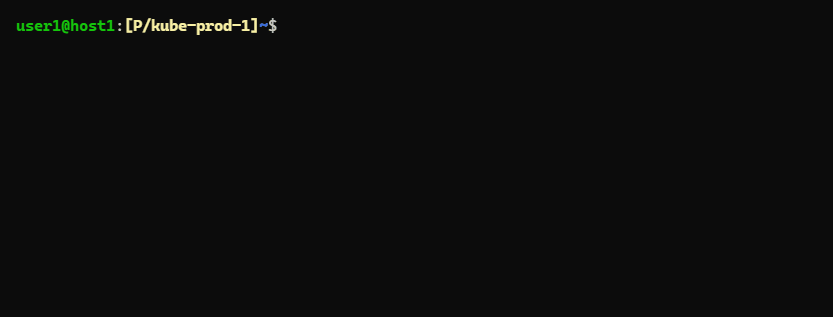

# shed-kubectl-exec-sh

Run **sh** in kubernetes resource via **kubectl exec** with context and/or namespace from current KubeConfig.

## SYNOPSIS

```bash
shed-kubectl-exec-sh (pod | type/name) [container]
shed kubectl-exec-sh (pod | type/name) [container]
k-sh (pod | type/name) [container]
```

## EXAMPLES

```bash
$ shed-use T; shed-kubectl-exec-sh pod/pod-abc
+ kubectl --context kube-test-1 exec -it pod/pod-abc -- sh
...

$ shed-use D; shed-kubectl-exec-sh pod/pod-abc
+ kubectl --context kube-dev-1 --namespace ns-application exec -it pod/pod-abc -- sh
...

$ shed-kubectl-exec-sh pod/pod-abc container-1
+ kubectl --context kube-dev-1 --namespace ns-application exec -it pod/pod-abc -c container-1 -- sh
...
```

## SCREENSHOTS



## SEE ALSO

- [shed-kubeconfig-use](shed-kubeconfig-use.md)
- [shed-kubectl](shed-kubectl.md)
- [shed-kubectl-exec-bash](shed-kubectl-exec-bash.md)
