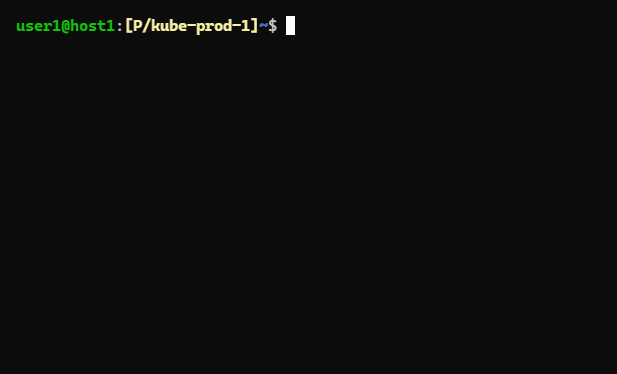

# shed-kubectl

Run **kubectl** command with context and/or namespace from current KubeConfig.

## SYNOPSIS

**shed-kubectl** [kubectl arguments]\
**shed kubectl** [kubectl arguments]\
**k** [kubectl arguments]

## SCREENSHOTS

## SEE ALSO

[shed-config](shed-config.md), [shed-use](shed-use.md), [shed-kubeconfig-use](shed-kubeconfig-use.md), [shed-helm](shed-helm.md), [shed-istioctl](shed-istioctl.md)\
[shed-kubectl-exec-sh](shed-kubectl-exec-sh.md), [shed-kubectl-exec-bash](shed-kubectl-exec-bash.md), [shed-kubectl-scale](shed-kubectl-scale.md)
