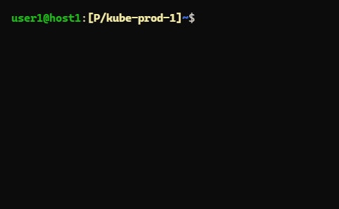

# shed-value-key-list

Print list of keys of Shed values. Use by `shed-value` for completion logic.

## SYNOPSIS

**shed-value-key-list**\
**shed value-key-list**

## SCREENSHOTS

## SEE ALSO

[shed-config](shed-config.md), [shed-values](shed-values.md), [shed-value](shed-value.md), [shed](shed.md)
