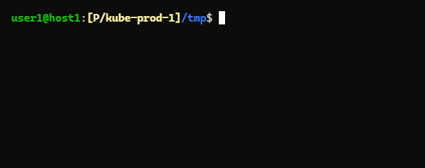

# shed-value

Get the config value of current shed.

## SYNOPSIS

```bash
shed-value yamlPath
shed value yamlPath
```

## SCREENSHOTS



## SEE ALSO

- [shed-config](shed-config.md)
- [shed-values](shed-values.md)
