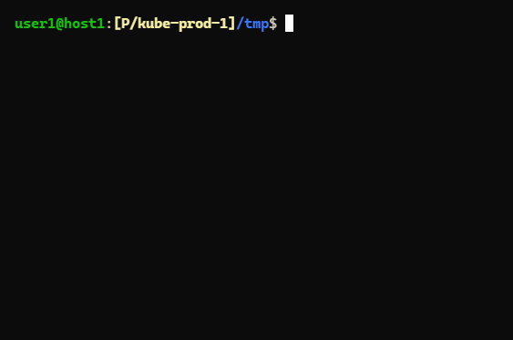

# shed-values

Print all config values of current shed.

## SYNOPSIS

```bash
shed-values
shed values
```

## SCREENSHOTS



## SEE ALSO

[shed-value](shed-value.md), [shed-config](shed-config.md), [shed-config.yaml](file-shed-config.yaml.md), [shed-value-key-list](shed-value-key-list.md), [shed-contexts](shed-contexts.md)
